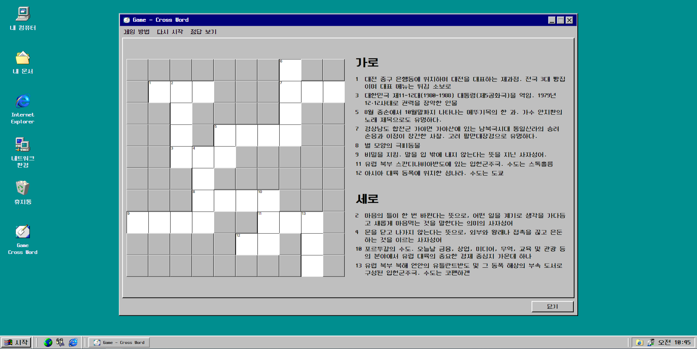
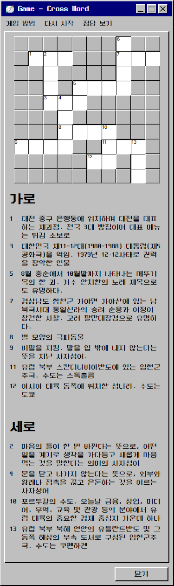
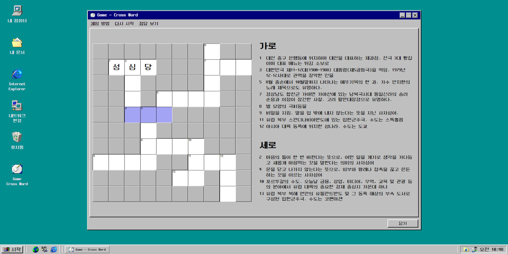
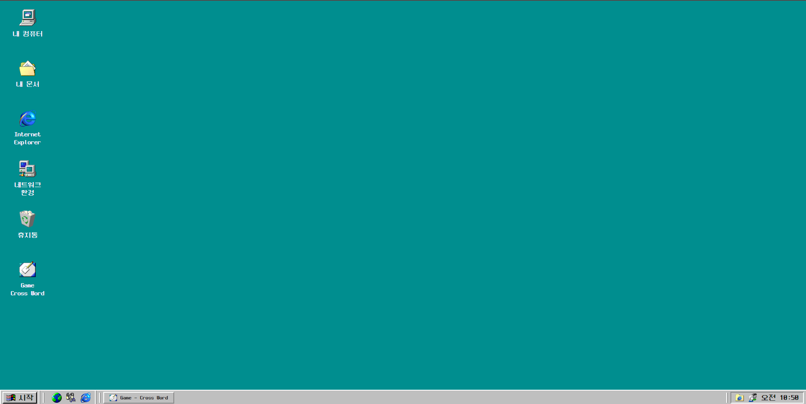
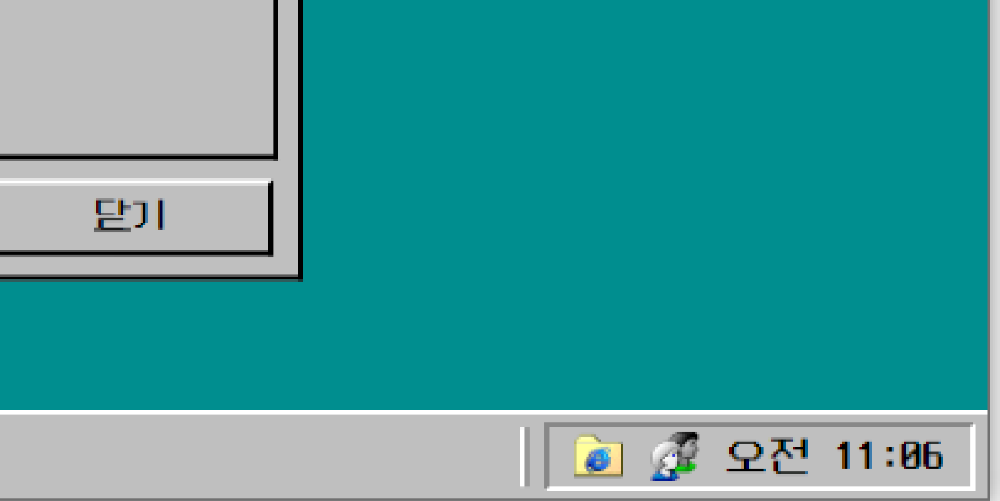
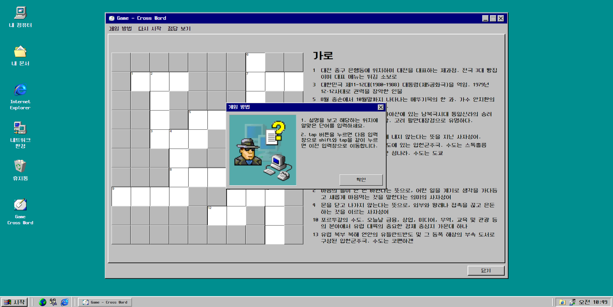
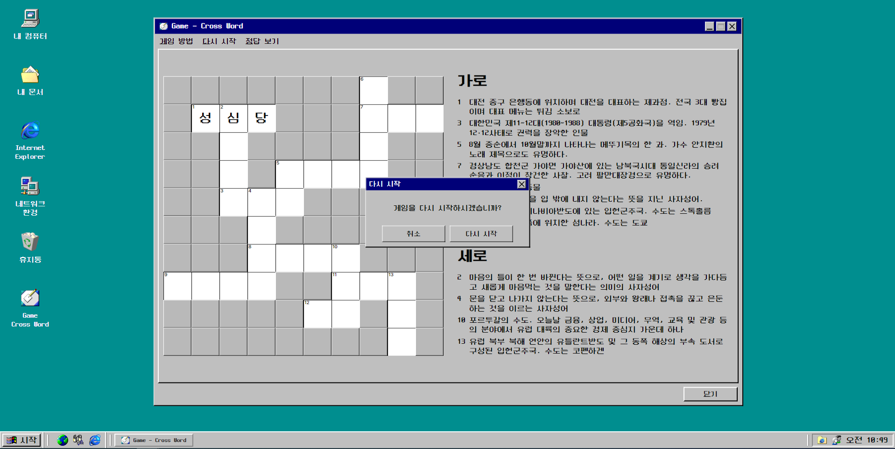
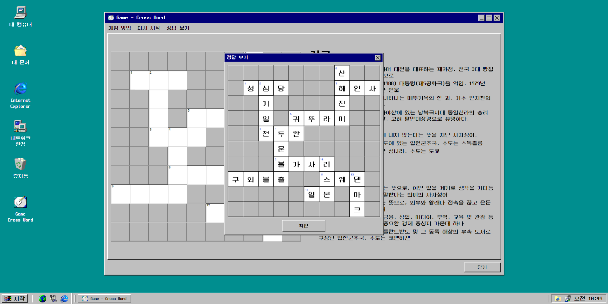

# crossword
✨ 링크 : https://seoin-crossword.netlify.app ✨  
<br>
Windows 98컨셉 가로세로 낱말퀴즈
<br>


## 📣 프로젝트 소개
- 개인프로젝트
- 새롭게 배운 css display:grid; 속성을 이용한 crossword(가로세로 낱말퀴즈) 페이지

### 📅 작업 기간
- 2023년 9월 23일 ~ 2023년 10월 10일

### 💻 사용 툴 및 작업 언어
- Adobe XD (디자인)
- Visual Studio Code
    - html, css, javascript, jQuery 

<br>

## 🎮 주요기능
- 반응형

|web|mobile|
|:---:|:---:|
|||

- 동적 요소

|hover|바탕화면|현재 시각|
|---|---|---|
||||
|설명 호버 시 input 위치 정보|닫기 버튼 클릭 시 바탕화면, 아이콘이나 상태바 클릭 시 다시 표시|현재 시각 표시|

|popup : 게임방법|popup : 다시 시작|popup : 정답보기|
|---|---|---|
||||
|게임 방법 클릭 시 팝업|다시 시작 클릭 시 입력값 전체 삭제|정답 이미지 팝업|

<br>

## 📌 프로젝트 작업하며 얻은 코드

<details>
  <summary>✨2023-10-12 추가 ✨ html의 class desNumRow${num},desNumCol${num}을 각각 불러오는 법</summary>
  <br>

  1. 함수를 정의하고 호출
  2. 삼항연산자에 true엔 .desNumRow${num}를 false엔 .desNumCol${num}을 작성하여 함수 호출 시 인자에 true와 false를 넣어주면 된다.
  3. 전체 코드는 [여기](https://github.com/se0in/crossword/commit/034f77cb2281352720d8ac1f620d117724c783da#diff-b551d945fe1c7c18cc181e866f335cffe5fdbaaf0d45a97d96b3cede5e6e8ad2)에서 확인

      ```javascript
      function createDescriptions(count, row) {
        for (let num = 1; num <= count; num++) {
          const selector = row ? `.desNumRow${num}` : `.desNumCol${num}`;
          window[`description${row ? "Row" : "Col"}${num}`] = document.querySelector(selector);
        }
      }
      const descriptionCount = 13;//중복 미포함 설명란 최대 숫자
      createDescriptions(descriptionCount, true); // 가로
      createDescriptions(descriptionCount, false); // 세로  
      ```
</details>

<details>
  <summary>✨2023-10-12 추가 ✨ 삼항연산자로 mouseenter, mouseleave 한번에 작성</summary>
  <br>

  1. isMouseEnter를 이용하여 true와 false에 style 속성값을 넣고 변수 정의
  2. addEventListener()도 삼항연산자 이용
  3. 전체 코드는 [여기](https://github.com/se0in/crossword/commit/034f77cb2281352720d8ac1f620d117724c783da#diff-b551d945fe1c7c18cc181e866f335cffe5fdbaaf0d45a97d96b3cede5e6e8ad2)에서 확인

      ```javascript
      //mouseenter 이벤트
      //삼항 연산자를 이용한 이벤트 등록 방법
      function addMouseHandler(description, inputs, isMouseEnter) {
        const bgColor = isMouseEnter ? "#a4a4f4" : "#fff";
        const textColor = isMouseEnter ? "#fff" : "#000";
        
        description.addEventListener(isMouseEnter ? "mouseenter" : "mouseleave", function () {
          for (let input of inputs) {
            input.style.backgroundColor = bgColor;
            input.style.color = textColor;
          }
        });
      }

      //...생략

      // 이벤트 핸들러 추가
      for (let i = 0; i < allDescriptions.length; i++) {
        const description = allDescriptions[i];
        const inputList = allInputs[i];

        if (description && inputList) {
          addMouseHandler(description, inputList, true);  // Mouse Enter 이벤트 추가
          addMouseHandler(description, inputList, false); // Mouse Leave 이벤트 추가
        }
      }
      ```
</details>

<details>
  <summary>✨2023-10-12 추가 ✨ 스프레드 연산자(...) 사용</summary>
  <br>

  1. 가로(descriptionRow)와 세로(descriptionCol)를 스프레드(...)연산자 사용해 합쳐 새로운 배열 생성 
  2. allDescriptions.length는 14가 된다.
  3. 전체 코드는 [여기](https://github.com/se0in/crossword/commit/034f77cb2281352720d8ac1f620d117724c783da#diff-b551d945fe1c7c18cc181e866f335cffe5fdbaaf0d45a97d96b3cede5e6e8ad2)에서 확인

      ```javascript
      // for 사용하여 input 요소 전체 선택 (없는 요소는 null)
      const descriptionsRow = [
        descriptionRow1,
        descriptionRow3,
        descriptionRow5,
        descriptionRow7,
        descriptionRow8,
        descriptionRow9,
        descriptionRow11,
        descriptionRow12
      ];

      // 세로 description 요소 배열
      const descriptionsCol = [
        descriptionCol2,
        descriptionCol4,
        descriptionCol5,
        descriptionCol6,
        descriptionCol10,
        descriptionCol13
      ];
      // ...생략

      //가로와 세로 description 배열을 하나로 합치기
      //스프레드 연산자(...) 사용
      const allDescriptions = [...descriptionsRow, ...descriptionsCol];
      const allInputs = [...inputListsRow, ...inputListCol];

      // 이벤트 핸들러 추가
      for (let i = 0; i < allDescriptions.length; i++) {
        const description = allDescriptions[i];
        const inputList = allInputs[i];

        if (description && inputList) {
          addMouseHandler(description, inputList, true);  // Mouse Enter 이벤트 추가
          addMouseHandler(description, inputList, false); // Mouse Leave 이벤트 추가
        }
      } 
      ```
</details>

<details>
  <summary>중복되는 코드를 반복문으로 불러오는 법</summary>
  <br>

  1. html class desNum1 ~ 13을 for문으로 돌려 `[description${num}]`에 담아 불러옴
  2. html class crossword_item1-1 ~ 10-10, 을 중첩 for문 사용해`[input${row}_${col}]` 배열로 불러옴
      
    ```javascript
    // for 사용하여 input 요소 전체 선택 (없는 요소는 null)
    for (let row = 1; row <= rowCount; row++) {
      for (let col = 1; col <= colCount; col++) {
        const selector = `.crossword_item${row}-${col} input`;
        window[`input${row}_${col}`] = document.querySelector(selector);
      }
    }

    // html description 요소(1~13) 선택 
    const descriptionCount = 13; 
    for(let num = 1; num <= descriptionCount; num++){
      let selector = `.desNum${num}`;
      window[`description${num}`] = document.querySelector(selector);
    }
    ```
</details>

<details>
  <summary>동일한 로직으로 흘러가는 popup을 javascript class를 활용하여 처리</summary>
  <br>

  1. 예외적으로 버튼이 2개 있는 replay popup은 if문 사용
  2. 전체 코드는 [여기](https://github.com/se0in/crossword/commit/034f77cb2281352720d8ac1f620d117724c783da#diff-b551d945fe1c7c18cc181e866f335cffe5fdbaaf0d45a97d96b3cede5e6e8ad2)에서 확인

      ```javascript
      class PopupHandler {
        constructor() {
          const popups = [
            { name: "howToPlay", trigger: "howToPlayLi" },
            { name: "replay", trigger: "replayLi", inputs: "crossword_board" },
            { name: "answer", trigger: "answerLi" },
          ];
        // ...생략
        inputClean(name) {
          const inputs = this[`$$crossword_board`];
          inputs.forEach((input) => (input.value = ""));
          this.hidePopup(name);
        };
      }};
      ```
</details>

<details>
  <summary>각각의 변수에 같은 이벤트를 반복해서 불러올 경우</summary>
  <br>

  1. 배열로 담아 반복문으로 처리
  2. 전체 코드는 [여기](https://github.com/se0in/crossword/commit/034f77cb2281352720d8ac1f620d117724c783da#diff-b551d945fe1c7c18cc181e866f335cffe5fdbaaf0d45a97d96b3cede5e6e8ad2)에서 확인

      ```javascript
      // 배열로 정의
      const descriptions = [
        description1, description2, description3, description4, description5,
        description7, description8, description9, description10, description11,
        description12, description13
      ];

      const inputLists = [
        [input2_2, input2_3, input2_4],
        [input2_3, input3_3, input4_3, input5_3],
        [input5_3, input5_4, input5_5],
        [input5_4, input6_4, input7_4, input8_4],
        [input4_5, input4_6, input4_7, input4_8],
        [input2_8, input2_9, input2_10],
        [input7_4, input7_5, input7_6, input7_7],
        [input8_1, input8_2, input8_3, input8_4],
        [input7_7, input8_7, input9_7],
        [input8_7, input8_8, input8_9],
        [input9_6, input9_7],
        [input8_9, input9_9, input10_9]
      ];

      // for문으로 반복되는 함수 호출
      for (let i = 0; i < descriptions.length; i++) {
        const description = descriptions[i];
        const inputList = inputLists[i];
        
        addMouseEnterHandler(description, inputList);
        addMouseLeaveHandler(description, inputList);
      }
      ```                         
  </details>
